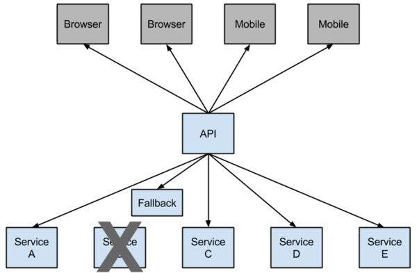

# Spring Cloud 服务的注册与发现

## Main Project

- SpringCloudDemo 主工程

  - SpringBoot 创建方式

    1. new project

    2. spring initializr

        name: 自定义

        type: maven/gradle

        package: jar

    3. spring version: 选择

       web: web

    4. 可以选择删除 src 文件夹，因为并不会使用

## Eureka Server Module

-  Eureka Server 服务注册中心

    - SpringServer 创建方式

        1. new module

        2. spring initializr

        3. Cloud Discovery

            Eureka Server

        4. 具体配置见 Pom.xml

- EurekaServer(服务注册中心) 从每个 EurekaClient(服务客户端)的实例接收消息。
  如果接收时间超时，通常会将该实例从注册中心删除。

- URL: http://localhost:8761

## Eureka Client Module

- Eureka Client 服务提供客户端

    - SpringServer 创建方式，同上

- 一个服务启动多个实例**

    更改 resources 下的 application.yml port 配置
    然后再次运行 EurekaclientApplication ，不要重启当前服务

    URL: http://localhost:8762/hi?name=***

    name 后边随便填写

- EurekaClient(服务提供客户端)，向 EurekaServer(服务注册中心)注册时，
  会提供一些`元数据`，例如：`主机名字`，`端口`，`URL`，`主页`等。

### 推荐 Resources 文件夹内的格式采用 properties，yml 格式要求太严格，容易出问题

## 服务调用负载均衡

### Service Ribbon

- Ribbon + TestTemplate 实现负载均衡

### Service Feign

- Feign + Eureka 实现负载均衡

## 断路器模式

- 微服务架构中，根据业务来拆分成一个个服务。

- 服务与服务之间可以相互调用(RPC)。在Spring Cloud可以用RestTemplate+Ribbon和Feign来调用。
  为了保证其高可用，单个服务通常会集群部署。由于网络原因或者自身的原因，服务并不能保证100%可用，
  如果单个服务出现问题，调用这个服务就会出现线程阻塞，此时若有大量的请求涌入，
  Servlet容器的线程资源会被消耗完毕，导致服务瘫痪。服务与服务之间的依赖性，故障会传播，
  会对整个微服务系统造成灾难性的严重后果，这就是服务故障的“雪崩”效应。

- 为了解决这个问题，业界提出了断路器模型。

- Netflix开源了Hystrix组件，实现了断路器模式，SpringCloud对这一组件进行了整合。 在微服务架构中，一个请求需要调用多个服务是非常常见的。

- 较底层的服务如果出现故障，会导致连锁故障。当对特定的服务的调用的不可用达到一个阀值（Hystric 是5秒20次） 断路器将会被打开。

  如下图：

  断路打开后，可用避免连锁故障，fallback方法可以直接返回一个固定值。