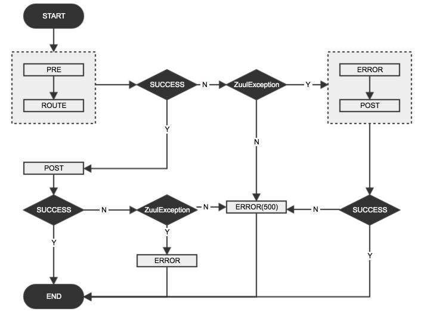

# Zuul 异常处理

## Zuul 的声明周期图

图片来自官方：---


实线表示请求必然经过的路径，而虚线表示可能会经过的路径。

- 所有请求都必然按照 `pre` -> `route` -> `post` 顺序执行。

- 如果 `pre` 中自定义 filter，则执行自定义 filter。

- 如果 `pre`，`route`，`post` 发送错误执行 `error`，然后再执行 `post`。

请求进入 `Zuul` 之后的整个调用链：

`ZuulServlet # service` -> `FilterProcess # processZuulFilter` -> `ZuulFilter # runFilter` -> `ZuulFilter # run`

## Zuul 调用链分析

#### 1. 请求首先进入 com.netflix.zuul.http.ZuulServlet 的 service() 方法。从包名`http`可以看出直接面向请求

```java
    try {
                init((HttpServletRequest) servletRequest, (HttpServletResponse) servletResponse);

                // Marks this request as having passed through the "Zuul engine", as opposed to servlets
                // explicitly bound in web.xml, for which requests will not have the same data attached
                RequestContext context = RequestContext.getCurrentContext();
                context.setZuulEngineRan();

                try {
                    preRoute(); // 1. pre
                } catch (ZuulException e) {
                    error(e); // 捕获 ZuulException 执行 error();
                    postRoute(); // 捕获 ZuulException 再执行 post
                    return;
                }
                try {
                    route(); // 2. route
                } catch (ZuulException e) {
                    error(e); // 捕获 ZuulException 执行 error();
                    postRoute(); // // 捕获 ZuulException 再执行 post
                    return;
                }
                try {
                    postRoute(); // 3. post
                } catch (ZuulException e) {
                    error(e); // 捕获 ZuulException 执行 error();
                    return;
                }

            } catch (Throwable e) {
                // 外层捕获异常后（内存三次 try 抛出的 非 ZuulException 异常 及内存 catch 抛出的异常）
                // 将 Http 状态设置为 500，交给 error(); 处理
                error(new ZuulException(e, 500, "UNHANDLED_EXCEPTION_" + e.getClass().getName()));
            } finally {
                RequestContext.getCurrentContext().unset();
            }
        }
```

- 正常情况下，请求只经过 `pre` -> `route` -> `post`。

- 两层 `try...catch`，内层只捕获 `ZuulException`，而其他异常由外层捕获。

- 内层`3个try...catch`语句，只有 `pre,route` 抛出 `ZuulException` 时，才会执行`error()`，再执行post()。而当post()抛出ZuulException后，只会执行error。

- 外层捕获其他异常(内层try语句块中抛出的非ZuulException异常以及内层catch语句中抛出的所有异常)后，将HTTP状态码设置为500，同时交给error处理。

- 整个流程的终点有两个：post及error；而非只有post一个。

- error() 源文件;

1. ZuulServlet.class
```java
    void error(ZuulException e) {
            RequestContext.getCurrentContext().setThrowable(e);
            zuulRunner.error();
        }
```

2. ZuulRunner.class
```java
    /**
     * executes "error" filterType  ZuulFilters
     */
     public void error() {
         FilterProcessor.getInstance().error();
     }
```

3. FilterProcessor.class
```java
     /**
     * runs all "error" filters. These are called only if an exception occurs. Exceptions from this are swallowed and logged so as not to bubble up.
     */
     public void error() {
         try {
             runFilters("error");
         } catch (Throwable e) {
             logger.error(e.getMessage(), e);
         }
     }

```

异常信息在 `1.` 内被 RequestContext 加入到了上下文中，进入了 `2.` error() 方法进行处理，
从而最终进入 FilterProcessor `3.` 最后处理。



#### 2. FilterProcess 调用 processZuulFilter(); 方法源码
#### public Object processZuulFilter(ZuulFilter filter) throws ZuulException

```java
       try {
            long ltime = System.currentTimeMillis();
            filterName = filter.getClass().getSimpleName();

            RequestContext copy = null;
            Object o = null;
            Throwable t = null; // ***

            if (bDebug) {
                Debug.addRoutingDebug("Filter " + filter.filterType() + " " + filter.filterOrder() + " " + filterName);
                copy = ctx.copy();
            }

            // ****该方法流程没有捕获异常，所有异常都是从 ZuulFilter 中获取的
            ZuulFilterResult result = filter.runFilter();
            ExecutionStatus s = result.getStatus();
            execTime = System.currentTimeMillis() - ltime;

            switch (s) {
                case FAILED:
                    t = result.getException(); // FAILED 状态，执行失败，捕获异常
                    ctx.addFilterExecutionSummary(filterName, ExecutionStatus.FAILED.name(), execTime);
                    break;
                case SUCCESS:
                    o = result.getResult();
                    ctx.addFilterExecutionSummary(filterName, ExecutionStatus.SUCCESS.name(), execTime);
                    if (bDebug) {
                        Debug.addRoutingDebug("Filter {" + filterName + " TYPE:" + filter.filterType() + " ORDER:" + filter.filterOrder() + "} Execution time = " + execTime + "ms");
                        Debug.compareContextState(filterName, copy);
                    }
                    break;
                default:
                    break;
            }

            if (t != null) throw t;

            usageNotifier.notify(filter, s);
            return o;

       } catch (Throwable e) {
            if (bDebug) {
                Debug.addRoutingDebug("Running Filter failed " + filterName + " type:" + filter.filterType() + " order:" + filter.filterOrder() + " " + e.getMessage());
            }
            usageNotifier.notify(filter, ExecutionStatus.FAILED);
            // 如果是 ZuulException，则抛出
            if (e instanceof ZuulException) {
                throw (ZuulException) e; // 转化为 ZuulException
            } else { // 如果不是 ZuulException 的实例，则转为 500 状态码的 ZuulException
                // 转化为 ZuulException
                ZuulException ex = new ZuulException(e, "Filter threw Exception", 500, filter.filterType() + ":" + filterName);
                ctx.addFilterExecutionSummary(filterName, ExecutionStatus.FAILED.name(), execTime);
                throw ex;
            }
       }
```

FilterProcessor 的 processZuulFilter() 可以看出，该方法调用了 ZuulFilter，
并且异常会重新抛出，如果`非 ZuulException` 则转为状态码为 `500` 的 ZuulException.

**ZuulFilter 中抛出任何形式的异常，最终都会被转化为 ZuulException 异常，并抛给上层调用者。即 ZuulServlet # service()，上述代码并没有
 捕获 ZuulFilter 执行的异常，而是从 ZuulFilterResult 获取的，详见上边代码注释。**

#### 3. ZuulFilter # runFilter();

 ```java
     /**
      * runFilter checks !isFilterDisabled() and shouldFilter(). The run() method is invoked if both are true.
      *
      * @return the return from ZuulFilterResult
      */
     public ZuulFilterResult runFilter() {
         ZuulFilterResult zr = new ZuulFilterResult();
         if (!isFilterDisabled()) {
             if (shouldFilter()) {
                 Tracer t = TracerFactory.instance().startMicroTracer("ZUUL::" + this.getClass().getSimpleName());
                 try {
                     Object res = run(); // run() 方法继承接口 IZuulFilter，此处调用的是 ZuulFilter 某个实现类的 run 方法
                     zr = new ZuulFilterResult(res, ExecutionStatus.SUCCESS);
                 } catch (Throwable e) {
                     t.setName("ZUUL::" + this.getClass().getSimpleName() + " failed");
                     zr = new ZuulFilterResult(ExecutionStatus.FAILED);
                     zr.setException(e);
                 } finally {
                     t.stopAndLog();
                 }
             } else {
                 zr = new ZuulFilterResult(ExecutionStatus.SKIPPED);
             }
         }
         return zr;
     }
 ```

调用 run(); 方法生成对象，如果不抛出异常，返回状态成功。如果抛出异常，返回失败，同时将异常信息设置到返回结果中。
